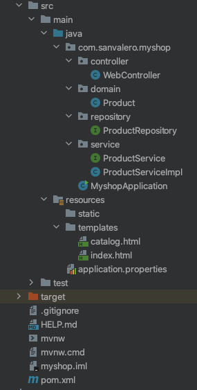

# Spring framework

Spring es un framework de Java para el desarrollo de aplicaciones y servicios web. En nuestro caso, lo que queremos construir es una pequeña aplicación web con una Base de Datos y que podamos, si asi lo queremos, proporcionar algo de lógica en el lado servidor cuando sea necesario. Para eso utilizaremos Spring Boot que es una parte de este framework que facilita bastante el trabajo para casos como el que a nosotros nos interesa.

Para eso, lo primero que haremos será utilizar el Spring Initializr para preparar el proyecto inicial sobre el que luego diseñaremos nuestra pequeña aplicación web.

Una vez tengamos creado el proyecto inicial, podemos empezar a trabajar en él. En este caso se trata de crear una aplicación web para una tienda de comercio electrónico para la que haremos, a modo de ejemplo, la zona donde se lista el catálogo de productos.

Configuración del servidor
Lo primero de todo será editar el fichero de configuración del proyecto para personalizarlo a nuestro caso:

application.properties
# Configuracion para el acceso a la Base de Datos
spring.jpa.hibernate.ddl-auto=update
spring.jpa.properties.hibernate.globally_quoted_identifiers=true
 
# Puerto donde escucha el servidor una vez se inicie
server.port=8080
 
# Datos de conexion con la base de datos MySQL
spring.datasource.url=jdbc:mysql://localhost:3306/myshoponline
spring.datasource.username=myshopuser
spring.datasource.password=mypassword
spring.datasource.driverClassName=com.mysql.jdbc.Driver
Hay que tener en cuenta que la propiedad spring.jpa.hibernate.ddl-auto se utiliza para que la base de datos se genere automáticamente en cada arranque de la aplicación. Esto nos interesará cuando estemos en desarrollo pero no cuando queramos desplegarla en producción. Por lo que tendremos que tener cuidado y controlar el valor de dicha propiedad.

none: Para indicar que no queremos que genere la base de datos
update: Si queremos que la genere de nuevo en cada arranque
create: Si queremos que la cree pero que no la genere de nuevo si ya existe
Definir la Base de Datos
Hay que tener en cuenta que Spring utiliza por debajo el framework de Hibernate para trabajar con la Base de Datos. Eso nos va a permitir trabajar con nuestras clases Java directamente sobre la Base de Datos, ya que será Hibernate quién realizará el mapeo entre el objeto Java (y sus atributos) y la tabla de MySQL (y sus columnas) a la hora de realizar consultas, inserciones, modificaciones o borrados. E incluso a la hora de crear las tablas, puesto que bastará con definir nuestro modelo de clases con las anotaciones apropiadas para que Spring pueda crearlas en base a éstas (y porque tenemos la opción spring.jpa.hibernate.ddl-auto=update en el fichero de configuración). Cuando ya no queramos que Spring genere automáticamente la base de datos en cada arranque (por ejemplo, en producción), tendremos que poner cambiar esa opción a valor none.

Simplemente tendremos que crear la base de datos. Y ya de paso aprovecharemos para crear un usuario con el que la aplicación web se conectará (de esa manera evitamos tener que configurar el acceso usando el usuario root).

CREATE DATABASE myshoponline;
CREATE USER myshopuser IDENTIFIED BY 'mypassword';
GRANT ALL PRIVILEGES ON myshoponline.* TO myshopuser;
Usaremos myshopuser como usuario y mypassword como usuario y contraseña en el fichero de configuración (application.properties) del proyecto.

Así, simplemente tenemos que crear la clase con los atributos y métodos que queramos y añadir las anotaciones que orientarán a Hibernate para saber a qué tabla corresponden los objetos de la clase y a qué columnas sus atributos.

Usaremos, además, la librería lombok para la generación automática de getters, setters y constructores.

import lombok.*;
 
import javax.persistence.*;
import java.time.LocalDateTime;
/**
 * Producto de la tienda online
 */
@Data
@AllArgsConstructor
@NoArgsConstructor
@Entity(name = "products")
public class Product {
 
    @Id
    @GeneratedValue(strategy = GenerationType.IDENTITY)
    private long id;
    @Column
    private String name;
    @Column
    private String description;
    @Column
    private String category;
    @Column
    private float price;
    @Column(name = "creation_date")
    private LocalDateTime creationDate;
}
Recordad que todas las anotaciones Java en el ejemplo anterior son clases que pertenecen al paquete 'javax.persistence'. Tened cuidado de no importar las mismas clases que existen en otros paquetes, aunque estén relacionados con Spring
El Acceso a la Base de Datos
Ahora creamos la interface donde se definirán los métodos que permitirán acceder a la Base de Datos. En este caso nos basta con definir las cabeceras de los mismos, puesto que se trata de una interface. Será el framework el que se encargue de su implementación. En este caso hemos definido métodos para obtener todas las puntuaciones y otro para obtener las que tengan una puntuación determinada. Además, podremos contar con que tenemos las operaciones que nos permiten registrar/modificar (save) y eliminar (delete) información de la Base de Datos.

/** 
 * Repositorio de Productos
 */
@Repository
public interface ProductRepository extends CrudRepository<Product, Long> {
 
    Set<Product> findAll();
    Product findByName(String name);
    Set<Product> findByNameAndPrice(String name, float price);
}
Implementación de la lógica de negocio: Los Services
Los Services serán la capa de nuestra aplicación web donde implementaremos toda la lógica de negocio.

Definiremos una interface con todos los métodos que necesitemos:

public interface ProductService {
 
    Set<Product> findAllProducts();
    Set<Product> findAllProducts(String category);
    void increasePrice(Product product);
}
Que implementaremos en la clase ProductServiceImpl

@Service
public class ProductServiceImpl implements ProductService {
 
    @Autowired
    private ProductRepository productRepository;
 
    @Override
    public Set<Product> findAllProducts() {
        return productRepository.findAll();
    }
 
    @Override
    public Set<Product> findAllProducts(String category) {
        return null;
    }
 
    @Override
    public void increasePrice(Product product) {
 
    }
}
Plantillas HTML para renderizar el contenido
Las plantillas HTML son los ficheros HTML que definen las diferentes secciones de la web en las que hay que renderizar contenido al usuario. Pueden contenter solamente código HTML (index.html) o también etiquetas del motor de plantillas Thymeleaf para acceder a objetos Java que le han sido pasados como parámetro. De esta manera podemos incluir estos datos en el contenido que se mostrará al usuario (catalog.html).

Estas plantillas están ubicadas siempre en la carpeta templates del proyecto. El controlador (implementando un poco más abajo) es quien accede a ellas y espera encontrarlas allí directamente. Por eso simplemente es necesario facilitarle el nombre de la misma (sin la extensión).

La página de inicio está definida por la plantila index.html y simplemente presenta cierto contenido HTML al usuario:

<!DOCTYPE html>
<html lang="en">
<head>
    <meta charset="UTF-8">
    <title>Inicio</title>
</head>
<body>
    <h1>Bienvenidos a mi tienda</h1>
    
Visita el <a href="catalog">catálogo</a> de productos

</body>
</html>
La página donde se lista el contenido del catálogo de la tienda online, la plantilla catalog.html contiene código HTML y también una serie de etiquetas del motor de plantillas para acceder a la información que ha sido parámetrizada desde el controlador (model.setAttribute(“products”, products)).

<!DOCTYPE html>
<html lang="en" xmlns:th="http://www.w3.org/1999/xhtml">
<head>
    <meta charset="UTF-8">
    <title>Catálogo</title>
</head>
<body>
    <h1>Catálogo de productos</h1>
    <ul th:each="product : ${products}">
        <li>

</li>
    </ul>
</body>
</html>
Implementación del Controller
Por último, crearemos la clase que hará de Controller de la aplicación. En ella introduciremos los métodos con las operaciones que queremos que nuestros usuarios puedan realizar, programaremos la lógica que necesitemos y accederemos a los datos a través del OpinionRepository que hemos creado en el paso anterior.

Por lo general los métodos del controlador tomarán como parámetro un objeto de la clase Model que es la plantilla que quedará asociada a él. De esa manera, podemos añadir atributos a dicha plantilla para que sea capaz de renderizar contenido de la parte Java (como hacemos con el método catalog). Estos métodos también devuelven un objeto String que será el nombre de la plantilla que debe ser renderizada una vez se ejecute el método. Estas plantillas estarán ubicadas en la carpeta templates del proyecto.

En este caso hemos creado tres métodos:

String index(Model model):
String catalog(Model model):
Cada una de los métodos tienen una URL de mapeo que marca el punto de entrada a la web para que se ejecute dicho método y se genere el código HTML correspondiente, que dependerá de la plantilla web devuelta (los métodos devuelven un String que es el nombre de la plantilla utilizada).

Asi, según el código implementado, hay 2 secciones en la web accesibles por las siguientes URLs:

http://localhost:8080: Página inicial que devuelve la plantilla index.html
http://localhost:8080/catalog: Página donde se lista el catálogo de productos de la web, con la plantilla catalog.html que está parametrizada y permite mostrar información utilizando el motor de plantillas Thymeleaf.
Teniendo en cuenta esto, si desplegáramos la aplicación en un servidor, le asociáramos un dominio y modificáramos el puerto para que escuchara en el 80, podríamos acceder a las secciones a través de las siguientes URLs:

http://www.myshoponline.com
http://www.myshoponline.com/catalog
/**
 * Controlador para la web
 *
 */
@Controller
public class WebController {
 
    @Autowired
    private ProductService productService;
 
    @RequestMapping(value = "/")
    public String index(Model model) {
        return "index";
    }
 
    @RequestMapping(value = "/catalog")
    public String catalog(Model model) {
        Set<Product> products = productService.findAllProducts();
        model.addAttribute("products", products);
        return "catalog";
    }
}
Asi, la estructura del proyecto que llevamos desarrollado hasta el momento tendrá que ser como el que se muestra en la siguiente imagen:

Figure 2: Estructura de proyecto de aplicación web con Spring Boot

Ejecución de la aplicación web
Una vez terminado todo, para lanzar el servidor tenemos dos opciones:

Desde el propio IDE, ejecutando mvn spring-boot:run
Utilizando el jar que podemos generar con el comando mvn package y ejecutarlo con el comando java -jar. El .jar generado lo podremos encontrar en la carpeta target